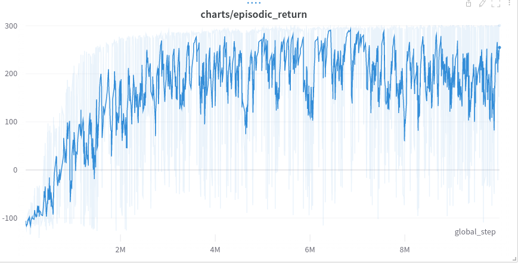
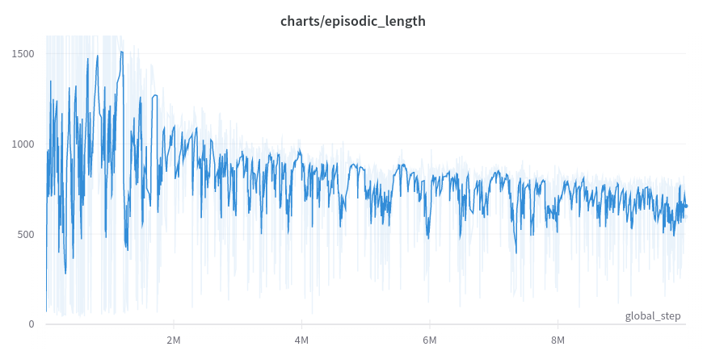

<a href="/gym">Main page</a>
# Bipedal walker (normal)
This [Bipedal walker](https://www.gymlibrary.ml/environments/box2d/lunar_lander/) environment is a simple 4-joint 
walker robot environment.
To solve the normal version, you need to get 300 points in 1600 time steps. 
Actions are motor speed values in the [-1, 1] range for each of the 4 joints at both hips and knees.
State consists of hull angle speed, angular velocity, horizontal speed, vertical speed, position of joints 
and joints angular speed, legs contact with ground, and 10 lidar rangefinder measurements. 
There are no coordinates in the state vector.
Reward is given for moving forward, totaling 300+ points up to the far end. 
If the robot falls, it gets -100. Applying motor torque costs a small amount of points.
A more optimal agent will get a better score.
The walker starts standing at the left end of the terrain with the hull horizontal,
and both legs in the same position with a slight knee angle.
The episode will terminate if the hull gets in contact with the ground or 
if the walker exceeds the right end of the terrain length.

First solution is based on Proximal policy optimization with following model:
```python
import torch
import torch.nn as nn
import numpy as np

def layer_init(layer, std=np.sqrt(2), bias_const=0):
    nn.init.orthogonal_(layer.weight, std)
    nn.init.constant_(layer.bias, bias_const)
    return layer

class BipedalWalkerModel(nn.Module):
    def __init__(self):
        super(BipedalWalkerModel, self).__init__()
        observations = 24
        n_actions = 4
        self.network = nn.Sequential(
            layer_init(nn.Linear(observations, 1024)),
            nn.ReLU(),
            layer_init(nn.Linear(1024, 512)),
            nn.ReLU(),
            layer_init(nn.Linear(512, 512)),
            nn.ReLU(),
        )
        self.critic = layer_init(nn.Linear(512, 1), std=1.)
        self.actor_means = nn.Sequential(layer_init(nn.Linear(512, n_actions), std=0.01), nn.Tanh())
        self.actor_logstd = nn.Parameter(torch.zeros(1, n_actions))

    def forward(self, x):
        hidden = self.network(x)
        return self.actor_means(hidden), self.critic(hidden)
```

and following hyper-parameters:
```python
anneal_lr=True
batch_size=1024
clip_coef=0.1
clip_vloss=True
ent_coef=0.01
gae_lambda=0.95
gamma=0.99
learning_rate=0.00025
max_grad_norm=0.5
minibatch_size=256
norm_adv=True
num_envs=8
num_minibatches=4
num_steps=128
seed=1
total_timesteps=10000000
update_epochs=4
vf_coef=0.5

```

and achieves average score of above 298.
Training metrics:


Result video:
<p align="center">
<iframe width="560" height="315" src="https://www.youtube.com/embed/fW-GrbLZZHk" title="YouTube video player" frameborder="0" allow="accelerometer; autoplay; clipboard-write; encrypted-media; gyroscope; picture-in-picture" allowfullscreen></iframe>
</p>

```python
import tensorflow.keras.layers as layers
from tensorflow.keras.models import Model
from tensorflow.keras.optimizers import Adam
def build_model(states, actions, learning_rate):
    inputs = layers.Input(shape=(states,))
    x = layers.Dense(256, activation="relu")(inputs)
    x = layers.Dense(256, activation="relu")(x)
    outputs = layers.Dense(actions, activation="linear")(x)
    model = Model(inputs, outputs, name="LunarLander")
    model.compile(Adam(learning_rate=learning_rate), loss="mse")
    return model
```

The hyperparameters of models are:
```python
replay_buffer_size = 1000000
training_batch_size = 64
max_episodes = 5000
max_steps = 3000
target_network_replace_frequency_steps = 100
model_backup_frequency_episodes = 25
starting_epsilon = 1
minimum_epsilon = 0.01
epsilon_decay = 0.996
discount_factor = 0.99
states = 8
actions = 4
learning_rate = 0.0005
```
The final model achieved 237.52 average reward for 100 episodes. That is enough to conclude that the task is solved.


