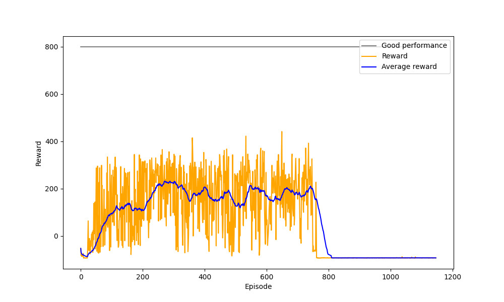

<a href="/gym">Main page</a>
# Car Racing (continuous)
This [Car racing](https://www.gymlibrary.ml/environments/box2d/car_racing/) environment 
is the easiest control task to learn from pixels - a top-down racing environment. 
The generated track is random every episode.

The reward is -0.1 every frame and +1000/N for every track tile visited,
where N is the total number of tiles visited in the track. For example,
if you have finished in 732 frames, your reward is 1000 - 0.1*732 = 926.8 points.

The episode finishes when all of the tiles are visited. 
The car can also go outside of the playfield - that is, far off the track, 
in which case it will receive -100 reward and die.

First in environments where the inputs are images it is usefull to do some preprocessing steps.
Image preprocessing:

Environment tricks:
- to let the agent understand the current dynamics it is usefull to provide as input not only last frame but 
several of last frames. (e.g. 2 last frames)
- sometimes it is usefull to skip some frames of game by performing one action. It is done to make a car more stable.

First try to solve this problem was the ddpg agent with following actor and critic models:
```python
from tensorflow.keras.models import Model
from tensorflow.keras.optimizers import Adam
import tensorflow.keras.layers as layers

class CarRacerModel(MaslouRLModelDDPGContinuous):
    def build_critic_model(self):
        state_input = layers.Input(shape=self.input_shape)
        x = layers.Conv2D(filters=32, kernel_size=8, strides=(4, 4), activation="relu", data_format='channels_first')(state_input)
        x = layers.Conv2D(filters=64, kernel_size=4, strides=(2, 2), activation="relu", data_format='channels_first')(x)
        x = layers.Conv2D(filters=64, kernel_size=3, strides=(1, 1), activation="relu", data_format='channels_first')(x)
        x = layers.Flatten()(x)

        action_input = layers.Input(shape=(self.n_actions,))
        x = layers.Concatenate()([x, action_input])
        x = layers.Dense(512, activation="relu")(x)
        x = layers.Dense(128, activation="relu")(x)
        outputs = layers.Dense(1, activation="linear")(x)
        model = Model(inputs=[state_input, action_input], outputs=outputs, name="CarRacer_critic")
        model.compile(optimizer=Adam(learning_rate=0.0002), loss="mse")
        return model

    def build_actor_model(self):
        state_input = layers.Input(shape=self.input_shape)
        x = layers.Conv2D(filters=32, kernel_size=8, strides=(4, 4), activation="relu", data_format='channels_first')(state_input)
        x = layers.Conv2D(filters=64, kernel_size=4, strides=(2, 2), activation="relu", data_format='channels_first')(x)
        x = layers.Conv2D(filters=64, kernel_size=3, strides=(1, 1), activation="relu", data_format='channels_first')(x)
        x = layers.Flatten()(x)
        x = layers.Dense(512, activation="relu")(x)
        x = layers.Dense(128, activation="relu")(x)
        output = layers.Dense(self.n_actions, activation="tanh")(x)
        model = Model(inputs=state_input, outputs=output, name="CarRacer_actor")
        model.compile(optimizer=Adam(learning_rate=0.00005), loss="mse")
        return model
```
Parameters for training were
```python
replay_buffer_size = 10000
training_batch_size = 64
num_episodes = 1500
max_steps = 1500
model_backup_frequency_episodes = 50
discount_factor = 0.99
tau = 0.005
noise = [0.1, 0.4]
train_every_step = 1
```
The results of training are following:

There is also a quite interesting behaviour of an agent. See a video:

<p align="center">
<iframe width="560" height="315" src="https://www.youtube.com/embed/ay-UZ1bjXwc" title="YouTube video player" frameborder="0" allow="accelerometer; autoplay; clipboard-write; encrypted-media; gyroscope; picture-in-picture" allowfullscreen></iframe>
</p>

The problem can be in several places. Not stability of ddpg method at all. The solutions will be to use
another method instead. The second one can be a hyper-parameters tuning.
First let`s try a smaller noise and learning rate.