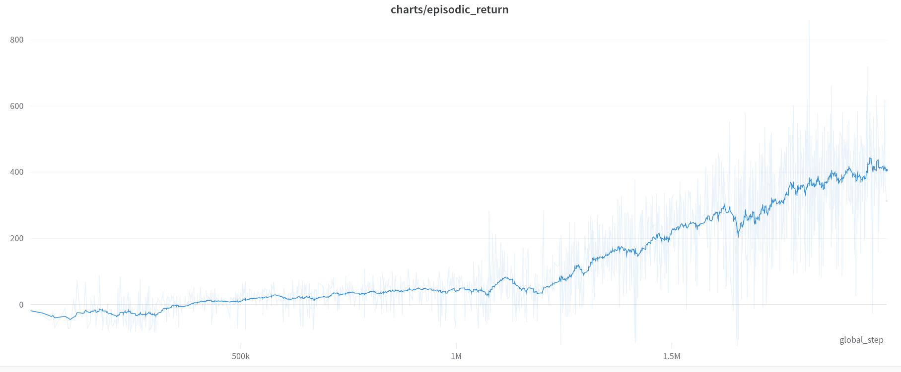
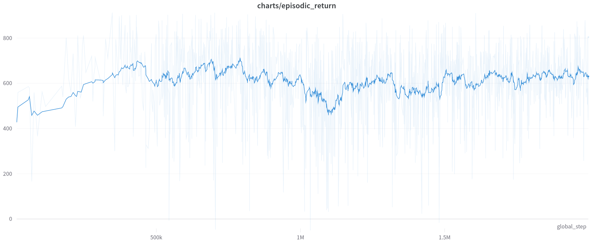

<a href="/gym">Main page</a>
# Car Racing (continuous)
This [Car racing](https://www.gymlibrary.ml/environments/box2d/car_racing/) environment 
is the easiest control task to learn from pixels - a top-down racing environment. 
The generated track is random every episode.

The reward is -0.1 every frame and +1000/N for every track tile visited,
where N is the total number of tiles visited in the track. For example,
if you have finished in 732 frames, your reward is 1000 - 0.1*732 = 926.8 points.

The episode finishes when all of the tiles are visited. 
The car can also go outside of the playfield - that is, far off the track, 
in which case it will receive -100 reward and die.

First in environments where the inputs are images it is usefull to do some preprocessing steps.
Image preprocessing:

Environment tricks:
- to let the agent understand the current dynamics it is usefull to provide as input not only last frame but 
several of last frames. (e.g. 2 last frames)
- sometimes it is usefull to skip some frames of game by performing one action. It is done to make a car more stable.

First try to solve this problem was the ddpg agent with following actor and critic models:
```python
from tensorflow.keras.models import Model
from tensorflow.keras.optimizers import Adam
import tensorflow.keras.layers as layers

class CarRacerModel(MaslouRLModelDDPGContinuous):
    def build_critic_model(self):
        state_input = layers.Input(shape=self.input_shape)
        x = layers.Conv2D(filters=32, kernel_size=8, strides=(4, 4), activation="relu", data_format='channels_first')(state_input)
        x = layers.Conv2D(filters=64, kernel_size=4, strides=(2, 2), activation="relu", data_format='channels_first')(x)
        x = layers.Conv2D(filters=64, kernel_size=3, strides=(1, 1), activation="relu", data_format='channels_first')(x)
        x = layers.Flatten()(x)

        action_input = layers.Input(shape=(self.n_actions,))
        x = layers.Concatenate()([x, action_input])
        x = layers.Dense(512, activation="relu")(x)
        x = layers.Dense(128, activation="relu")(x)
        outputs = layers.Dense(1, activation="linear")(x)
        model = Model(inputs=[state_input, action_input], outputs=outputs, name="CarRacer_critic")
        model.compile(optimizer=Adam(learning_rate=0.0002), loss="mse")
        return model

    def build_actor_model(self):
        state_input = layers.Input(shape=self.input_shape)
        x = layers.Conv2D(filters=32, kernel_size=8, strides=(4, 4), activation="relu", data_format='channels_first')(state_input)
        x = layers.Conv2D(filters=64, kernel_size=4, strides=(2, 2), activation="relu", data_format='channels_first')(x)
        x = layers.Conv2D(filters=64, kernel_size=3, strides=(1, 1), activation="relu", data_format='channels_first')(x)
        x = layers.Flatten()(x)
        x = layers.Dense(512, activation="relu")(x)
        x = layers.Dense(128, activation="relu")(x)
        output = layers.Dense(self.n_actions, activation="tanh")(x)
        model = Model(inputs=state_input, outputs=output, name="CarRacer_actor")
        model.compile(optimizer=Adam(learning_rate=0.00005), loss="mse")
        return model
```
Parameters for training were
```python
replay_buffer_size = 10000
training_batch_size = 64
num_episodes = 1500
max_steps = 1500
model_backup_frequency_episodes = 50
discount_factor = 0.99
tau = 0.005
noise = [0.1, 0.4]
train_every_step = 1
```
The results of training are following:

There is also a quite interesting behaviour of an agent. See a video:

<p align="center">
<iframe width="560" height="315" src="https://www.youtube.com/embed/ay-UZ1bjXwc" title="YouTube video player" frameborder="0" allow="accelerometer; autoplay; clipboard-write; encrypted-media; gyroscope; picture-in-picture" allowfullscreen></iframe>
</p>

The problem can be in several places. Not stability of ddpg method at all. The solutions will be to use
another method instead. The second one can be a hyper-parameters tuning.

The next try of solving this env was done with Proximal Policy Optimization
with following model
```python
import torch
import torch.nn as nn
import numpy as np
def layer_init(layer, std=np.sqrt(2), bias_const=0):
    nn.init.orthogonal_(layer.weight, std)
    nn.init.constant_(layer.bias, bias_const)
    return layer
class CarRacingModel(nn.Module):
    def __init__(self):
        super(CarRacingModel, self).__init__()
        n_actions = 3
        self.network = nn.Sequential(
            layer_init(nn.Conv2d(4, 32, 8, stride=4)),
            nn.ReLU(),
            layer_init(nn.Conv2d(32, 64, 4, stride=2)),
            nn.ReLU(),
            layer_init(nn.Conv2d(64, 64, 3, stride=1)),
            nn.ReLU(),
            nn.Flatten(),
            layer_init(nn.Linear(64 * 7 * 7, 512)),
            nn.ReLU()
        )
        self.critic = layer_init(nn.Linear(512, 1), std=1.)
        self.actor_means = nn.Sequential(layer_init(nn.Linear(512, n_actions), std=0.01), nn.Tanh())
        self.actor_logstd = nn.Parameter(torch.zeros(1, n_actions))

    def forward(self, x):
        hidden = self.network(x)
        return self.actor_means(hidden), self.critic(hidden)
```

and hyper-parameters:
```python
anneal_lr=True
average_reward_2_save=20
batch_size=2048
clip_coef=0.2
ent_coef=0.01
gae_lambda=0.95
gamma=0.99
learning_rate=0.0003
max_grad_norm=0.5
minibatch_size=128
norm_adv=True
num_envs=16
num_minibatches=16
num_steps=128
total_timesteps=2000000
track=True
update_epochs=10
vf_coef=0.5
```
The training were performed two times. First with lr=3e-4, the second one with lr=1e-4
First training was done in 13 hours and achieve the best average in 450 reward and have the following reward metrics

The second training continued from checkpoint of previous model and achieved 750+ mean reward that is enough to 
consider that the environment is solved. Totally the model was training for 26 hours for two trainings.


You can see how the model performs on next video.
<p align="center">
<iframe width="560" height="315" src="https://www.youtube.com/embed/whDEGTncRp8" title="YouTube video player" frameborder="0" allow="accelerometer; autoplay; clipboard-write; encrypted-media; gyroscope; picture-in-picture" allowfullscreen></iframe>
</p>