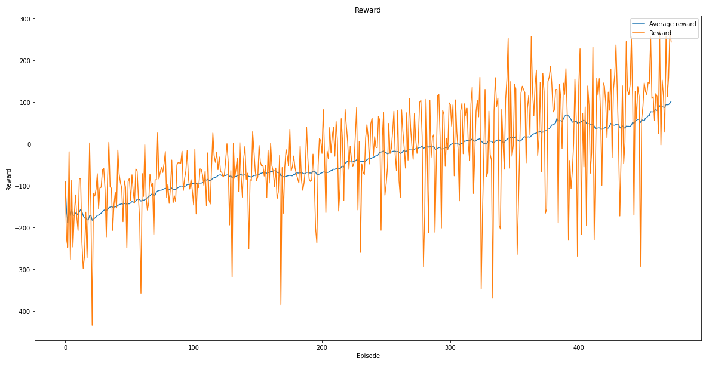

<a href="/gym">Main page</a>
# Lunar Lander v2 (Discrete)
This [Lunar Lander v2](https://www.gymlibrary.ml/environments/box2d/lunar_lander/) environment is a classic rocket trajectory optimization problem.
According to Pontryagin’s maximum principle, it is optimal to fire the engine at full throttle or turn it off. 
This is the reason why this environment has discrete actions: engine on or off.

Reward for moving from the top of the screen to the landing pad and coming to rest is about 100-140 points. 
If the lander moves away from the landing pad, it loses reward. If the lander crashes,
it receives an additional -100 points. If it comes to rest, it receives an additional +100 points.
Each leg with ground contact is +10 points. Firing the main engine is -0.3 points each frame. 
Firing the side engine is -0.03 points each frame. Solved is 200 points.

The episode finishes if:
<ul>
    <li>the lander crashes (the lander body gets in contact with the moon);</li>
    <li>the lander gets outside of the viewport (x coordinate is greater than 1);</li>
    <li>the lander is not awake. From the Box2D docs, a body which is not awake is a body which doesn’t 
    move and doesn't collide with any other body.</li>
</ul>

First solution was based on vanilla deep q learning. However, it did not perform well cause of problems of 
vanilla learning. .
Second solution that performs good enough is based on double q learning. Double q learning is a technique where
appears a target model to prevent learning bias that is in vanilla learning.

